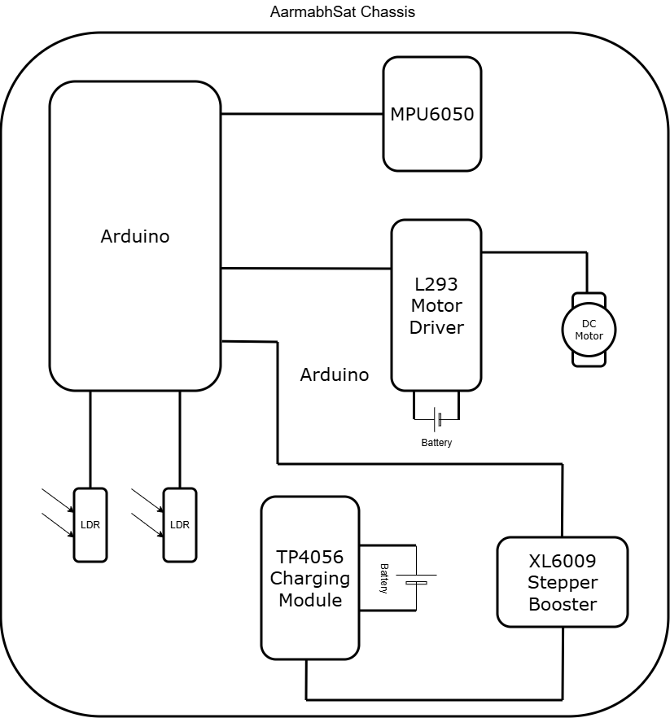

**Goal:**  
Platform auto-rotates (1-axis) so the brightest LDR faces the lamp — representing Sun tracking.

Why this is important system :
- For power generation we need to direct our solar panels towards the sun
- For radio transmission we need to direct our telecomm towards earth

>In the book project hail Mary, the earth in in extinction, and best way to retrieve data was to use reaction wheels

| Concept                                  | Link                                                                                  |
| ---------------------------------------- | ------------------------------------------------------------------------------------- |
| Component Technical Sheet                | [Component Technical Sheet](../assets/Component_Technical_Sheet.pdf)                  |
| What makes the satellite rotate          | [reaction wheel theory](reaction-wheel-theory.md)                                     |
| Physics behind reaction wheel            | [Tutorial/Theory on Reaction Wheel](https://youtu.be/zkB3eqjh_mk?si=pBcxIVd9OCK9g9aG) |
| About the MPU6050                        | [MPU6050 notes](mpu6050-notes.md)                                                     |
| documentation of MPU6050                 | [MPU6050 datasheet (PDF)](../assets/docs/documentation_MPU6050_light.pdf)            |
| stablising the accelerometer and gyro    | [stabilising accelerometer and gyro](stabilising-accelerometer-and-gyro.md)          |
| caliberating the motor with gyro         | [calibrating motor with gyro](calibrating-motor-with-gyro.md)                        |
| failing motor threshold issue            | [motor threshold error debugging](motor-threshold-error-debugging.md)                 |
| Battery Management                       | [battery management](battery-management.md)                                           |
| Lipo battery connections                 | [how to use the LiPo battery](how-to-use-the-lipo-battery.md)                        |
| difference between li-ion and li-polymer | [difference between lithium-ion and lithium-polymer](difference-between-lithium-ion-and-lithium-polymer.md) |
| powering my arduino                      | [how to power my Arduino Uno](how-to-power-my-arduino-uno.md)                        |
| Cube sat Battery Module                  | [rechargeable battery module](rechargeable-battery-module-adjustable-output-35v.md)   |
| Schematic Connection diagram             |          |
| 3D model diagram                         |                 |
|                                          |                 |
|                                          |               |
